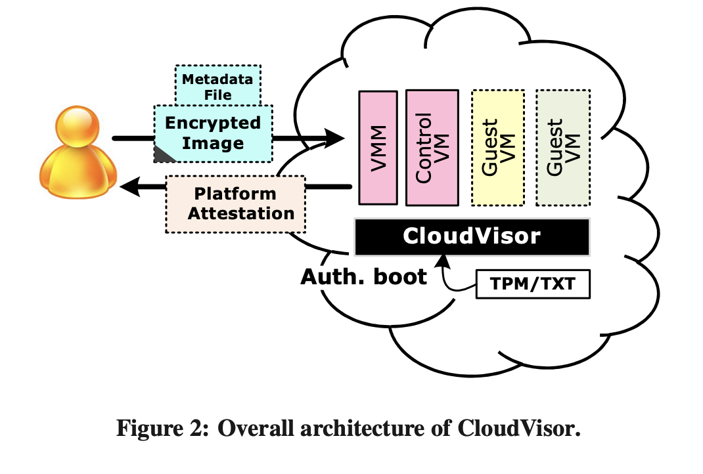
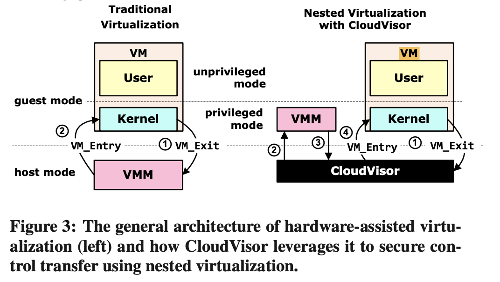
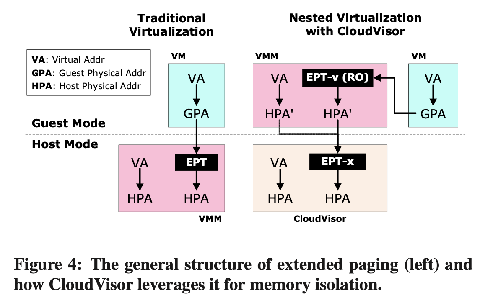
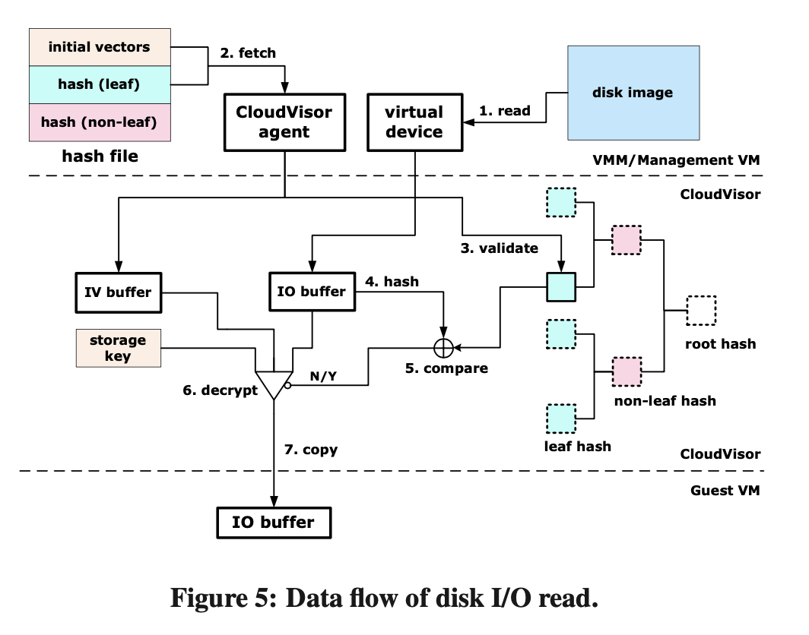

### **CloudVisor: 利用嵌套虚拟化对多租户云中的虚拟机进行保护**

##### CloudVisor: Retrofitting Protection of Virtual Machines in Multi-temmmmnant Cloud with Nested Virtualization

---

## 背景

+ 多租户云(Multi-tenant Cloud)面临的安全威胁
  + 用户的敏感数据放在第三方云平台上计算
+ 面临安全问题的原因
  + off-the-shelf virtualized方式的TCB过大，上百万行代码
  + 使用同一个云服务平台的其他用户，甚至云服务商本身也是潜在的安全威胁

<!-- 首先介绍下相关背景。多租户云(Multi-tenant Cloud)可以为用户方便地提供可伸缩的计算资源，在目前被广泛使用。但是，多租户云也面临着新的安全威胁和挑战：用户的敏感数据被放在第三方云平台上进行计算，然而现有的很多云平台仅仅保证用户本人的实例上是安全的。
本文认为，云平台的严重安全问题主要有两个原因。一方面，off-the-shelf virtualized infrastructures会带来泄露VM的问题。这种方式的TCB包括了整个VMM和management VM，大概有上百万行代码。另一方面，使用同一个云服务平台的其他用户，甚至云服务商本身也是潜在的安全威胁，可能窃取敏感数据。

针对这些问题，前人的工作包括：完全移除虚拟化层，建立一个新的类似VMM的微内核，或者保护VMM控制流的完整性等。但是这些工作只考虑到其他恶意VM，没有考虑到来自VMM的安全威胁。此外，这些工作都要求对VMM的核心代码进行改动，甚至重构VMM，这样做并不利于在已经商用的虚拟化云上推广。

 -->

---

## 背景

+ 前人的工作
  + 完全移除虚拟化层
  + 建立一个新的类似VMM的微内核
  + 保护VMM控制流的完整性
+ 问题
  + 只考虑到其他恶意VM，没有考虑到来自VMM的安全威胁
  + 对VMM的核心代码进行改动，甚至重构VMM

<!--

针对这些问题，前人的工作包括：完全移除虚拟化层，建立一个新的类似VMM的微内核，或者保护VMM控制流的完整性等。但是这些工作只考虑到其他恶意VM，没有考虑到来自VMM的安全威胁。此外，这些工作都要求对VMM的核心代码进行改动，甚至重构VMM，这样做并不利于在已经商用的虚拟化云上推广。

 -->

---

## 设计目标

* **将安全性保护和资源管理分离**
  + 使用嵌套虚拟化技术，将安全性保护和资源管理分离
  + 和商用虚拟化栈向后兼容
  + TCBsize从上百万行代码减少到几千行
* **更全面的保护**
  + 提供对整个虚拟机的保护，保护来自恶意VM和management VM的攻击
* **性能开销低**
  + 利用虚拟化硬件支持的实现
  + 性能开销低

<!-- 设计目标 -->
---

## CloudVisor 威胁模型

+ 攻击者包括本地攻击者和远程攻击者，假设他们能够控制整个VM management stack；VM的内存，磁盘和代码都有可能被泄露。
+ 不会出现内部物理攻击，外部磁盘存储不可信
+ 保证除 VM 自身以外的所有访问者（如 VMM、其他 VM）不能直接访问 VM 数据，如 DMA、内存转储和 I/O 数据，只能看到加密版本。
+ VMM 不能伪造执行上下文来让 VM 运行。攻击者不能更改启动环境或欺骗租户的 VM 以错误的执行模式运行

<!--

假设：我们假设云提供商本身不会有意或有目的地篡改或窃取其租户的敏感信息。相反，威胁可能来自其操作员的意外或有意的操作[26, 63]。因此，我们假设不会出现内部物理攻击，例如将探针放入总线中并冻结所有主存储器以读取数据。实际上，典型的数据中心通常对物理访问进行严格控制，并通过监视摄像头监视和记录这些访问。但是，由于操作员可以通过VM管理堆栈甚至物理维护（例如磁盘更换）轻松访问磁盘存储，因此我们假设外部磁盘存储不可信。

恶意 VMM 不能从 VMM 向租户 VM 发出任意的控制传输。所有 VMM 和 VM 之间的控制传输都必须通过 CloudVisor 定义的入口和出口点进行中介。VMM 不能伪造执行上下文来让 VM 运行。实际上，在控制传输期间，VM 的执行上下文是由 CloudVisor 安全保存和恢复的。因此，攻击者不能更改启动环境或欺骗租户的 VM 以错误的执行模式运行，如一种 para-virtualized 模式和不同的分页模式，这些都会被 CloudVisor 检测并拒绝。

 -->

---
## CloudVisor 威胁模型

做不到什么：
+ CloudVisor cannot guarantee availability and execution correctness of a tenant’s VM.
+ CloudVisor does not guard against side-channel attacks in the cloud, which may be hard to deploy and have very limited bandwidth to leak information.
+ CloudVisor also provides no protection to interactions of a VM with its outside environments.

<!--
CloudVisor无法保证租户的虚拟机的可用性和执行正确性，因为虚拟机仍然使用由VMM及其管理虚拟机和工具提供的服务。但是，我们认为这对于多租户云来说不是一个问题，因为云提供商的主要目标是向用户提供具有特定服务级别协议的效用式计算资源。提供降级甚至错误的服务将很容易被客户发现，而恶意提供商或运营者将很快被淘汰出市场。

CloudVisor不能防止云中的侧信道攻击[49]，这可能难以部署并且泄漏信息的带宽非常有限。然而，CloudVisor确实利用了最近CPU中的AES指令等先进硬件功能来防止密码密钥泄漏[56]。此外，许多安全关键应用程序，如OpenSSL，具有内置机制来防御侧信道攻击。

CloudVisor也不提供对虚拟机与其外部环境的交互的保护。因此，租户虚拟机的安全性最终受限于虚拟机本身。例如，攻击者仍然可以通过利用虚拟机内的安全漏洞来破坏虚拟机。这通常可以通过利用传统的应用程序和操作系统的安全增强机制来减轻。CloudVisor确保，控制已被破坏的虚拟机甚至已经破坏了管理软件或VMM的对手，无法进一步破坏CloudVisor对同一台机器上其他虚拟机的安全保护。
 -->

---

## CloudVisor 整体设计

### Design Consideration

+ Transparent Interposition using Nested Virtualization
+ VM-based Memory Ownership Tracking
+ I/O Protection through Encryption
+ Late Launch to Reduce CloudVisor Complexity

<!-- CloudVisor的总体设计思路
1，使用嵌套虚拟化进行抽象
2，基于VM的内存使用者追踪
3，基于加解密的I/O保护
4，Late Launch
 -->

---
### The CloudVisor Architecture

+ Runs at the **most privileged level**
+ commodity VMM is deprivileged into the **less privileged** mode together with the control VM and guest VMs
+ CloudVisor enforces the **isolation and protection** of resources used by each guest VM and ensures the isolation among the VMM and its guest VMs
+ Traditional virtualization functionalities are still done by the VMM

<!--
这是CloudVisor的整体设计结构，有几个特点。
1，CloudVisor本身跑在最高特权级，VMM和VM都在更低的特权集
2，虚拟化功能仍然由VMM实现
3，CloudVisor进行资源隔离

下面介绍几个关键技术点
-->

---

## Securing Control Transition with Nested Virtualization

  

  + placing the VMM into a less privileged mode
  + CloudVisor ensure strict isolation among the VMM and its VMs

  

  

  

  

<!-- 使用嵌套虚拟化技术保护CPU ，总的来说，设计思路是

+ placing the VMM into a less privileged mode
+ CloudVisor ensure strict isolation among the VMM and its VMs

-->

---
### Enabling Interposition

+ maintains a VMCS for the VMM, VMM only gets trapped on three types of architectural events relating to resource isolation:
  + **NPT/EPT faults**, which are caused by faults on translation from guest physical address to host physical address
  + Execution of **instructions in the virtualization instruction** set such as VMRead/VMWrite
  + **IOMMU faults**, which is caused by faults during the translation from device address to host physical address
+ Other architectural events do not cause traps to CloudVisor and are directly delivered to the VMM.
+ Change VMCS of guest VM. CloudVisor records the entry address of VM-exit in VMCS and replaces it with the entry address of the handler in CloudVisor.

<!--
具体一点是怎么做的

CloudVisor维护一个VMCS来控制VMM执行时会引起VM exit的指令或事件的类型to control the types of instructions or events that will cause VM exit when executing in the VMM’s context

VMM只会在三种涉及资源隔离的架构事件上trap：
  NPT/EPT故障，由于从客户机物理地址到主机物理地址的转换而引起的故障
  执行虚拟化指令集中的指令时，如VMRead/VMWrite
  IOMMU故障，由于从设备地址到主机物理地址的转换期间引起的故障
其他事件，如页面故障和中断，不会导致trap到CloudVisor，并直接传递到VMM

CloudVisor记录了VM-exit的入口地址，并用CloudVisor中处理程序的入口地址替换它。

-->
---

### Securing Control Transition

CloudVisor interposes between guest VMs and the VMM on VM exit for mainly three purposes:
+ protecting CPU register contexts when a VM is interrupted;
+ manipulating address translation to enforce memory isolation (detailed in section 5);
+ intercepting and parsing I/O instructions to determine the I/O buffer addresses in a VM (detailed in section 6).

<!-- 它这样做有几个好处

在VM被中断时保护CPU寄存器上下文；
操纵地址转换以强制执行内存隔离（详见第5节）；
拦截和解析I/O指令以确定VM中的I/O缓冲区地址（详见第6节）。

 -->

---
##### 流程

+ interposes each VM exit event (step 1), protects CPU contexts and parses I/O instructions if necessary
+ forwards the VM exit event to the VMM (step 2).
+ intercepts the VM entry request from the VMM (step 3)
+ restores CPU contexts and resumes the execution of guest VM (step 4) accordingly

<!-- ---

##### VM exits caused by synchronous instruction execution
CloudVisor only resets a part of the register contexts and keeps the states that are essential for the event handling.

##### the CPU context on VM entry is exactly the same with the context on last VM exit for each virtual CPU
the VMM is unable to dump CPU register information by triggering arbitrary interrupts, redirect control to arbitrary code in the guest VM, or tamper with the CPU context of the guest VMs. -->

---

### Dynamic Nested Virtualization

+ CloudVisor does not contain machine bootstrap code for the sake of small TCB.
+ Consequently, it is **booted after the VMM and the management VM have been initialized**.
+ When CloudVisor boots, it runs in host mode and demotes the VMM to guest mode, thus effectively virtualizes the VMM on the fly.

<!--
为了减少TCBsize，CV会在VMM and the management VM have been initialize之后再启动

 -->
---

## MEMORY ISOLATION

### Isolation with Nested/Extended Paging

#### general structure of extended paging

+ The guest VM manages the address translation from VA to GPA with the conventional page table.
+ translate guest physical addresses (GPA) to HPA using an extended page table (EPT)

<!--
第二部分的技术是内存隔离，使用嵌套页表方式进行的。

首先介绍一下在没有CloudVisor的时候，这个要怎么做。

从VA到GPA的部分在VM中执行，GPA到HPA在VMM使用extended page table来做。

 -->

---

#### CloudVisor

+ extended page table (EPT)
+ CloudVisor: GPA-to-HPA mapping EPT for the VMM
+ EPT-x is kept in the memory space of CloudVisor and is not accessible by the VMM.
+ only supports platforms with hardware-assisted address translation.

<!-- CloudVisor创建了一个VMM的扩展页表(EPT)，然后配置VMM的地址转换,使用一个使用页表(VA到GPA)和扩展页表(EPT)(GPA到HPA)的两步地址转换。
CloudVisor为VMM维护了一个身份GPA到HPA的映射(EPT-x)，该映射是保持在CloudVisor的内存空间中的，VMM无法访问。
CloudVisor目前仅支持具有硬件辅助地址转换的平台。 -->

---

### Memory Ownership Tracking

+ maintains a table to track the ownership of each physical memory page.
+ The value of the table is the owner ID of the page. Each VM is assigned with a unique ID when it is booted. The VMM’s ID is fixed to zero.
+  a physical memory page can only be assigned to be one owner at a time.

<!--
为了确保在 VMM 和其 guest VMs 之间实现内存隔离，CloudVisor 维护一个表来跟踪每个物理内存页的所有权。
该表的值是页面的所有者 ID。当 VM 启动时，为每个 VM 分配一个唯一的 ID。VMM 的 ID 固定为零。
CloudVisor 确保一个物理内存页只能分配给一个所有者。
 -->

---
### Legal Memory Accesses

CloudVisor interposes and assists such accesses to ensure that **only minimal insensitive information** will be divulged.

1. Privileged instructions such as I/O instructions and accesses to control registers cause traps (i.e., VM exits) that are handled by the VMM.
    + VMM needs to get the instruction opcode in the guest VM memory to emulate it
    + CloudVisor **only allows fetching one opcode** pointed by the program counter

<!--
There are several cases where the VMM and the management VM should be allowed to access some memory of guest VMs.

In such cases, CloudVisor interposes and assists such accesses to ensure that only minimal insensitive information will be divulged.

-->

---

### Legal Memory Accesses

（TODO）
2. The VMM needs to walk the page table in the guest VM to translate the virtual addresses to guest physical addresses
    + CloudVisor temporarily allows the VMM to indirectly read the **guest page table entries** corresponding to **the opcode and memory operands**
    + CloudVisor fetches the program counter of the instruction and parses the instruction to get the memory operand.
    + CloudVisor walks the page table in the guest VM to get the page table entries required to translate the program counter and the memory operands
    + When the VMM accesses the page table, CloudVisor *feeds it with the previously obtained page table entries*.

<!--
VMM需要walk客户机虚拟地址的页表将其翻译成客户机物理地址
简而言之就是CloudVisor把这些事情都做了，然后把最终结果给到VMM
 -->
---

### Legal Memory Accesses

3. The VMM also needs to get the contents of guest I/O buffers when emulating I/O accesses.
    + When the VMM accesses I/O buffers, an EPT fault is raised and CloudVisor handles the fault by copying the data for the VMM.

<!--
当VMM在模拟I/O访问时，还需要获取客户VM的I/O缓冲区内容。
当VMM访问I/O缓冲区时，会引发EPT故障，CloudVisor增加一次数据复制。
 -->

---

## DISK STORAGE PROTECTION

### Two alternative ways
+ The first one is letting a cloud user use an encrypted file system that guard the disk I/O data at the file-system level
+ CloudVisor also provides full-disk encryption and hashing to protect disk data privacy and integrity. CloudVisor **encrypts the data exchange between a VM and the VMM** and verifies the integrity, freshness and ordering of disk I/O data.

<!--
第三个重要技术是保护磁盘数据。

对于磁盘上的数据保护有两种方式。
第一种方法是让用户使用一个加密的文件系统，该文件系统在文件系统级别保护磁盘I/O数据。
第二种方法就是CloudVisor 还提供了全盘加密和哈希，以保护磁盘数据的隐私和完整性。CloudVisor加密VM和VMM之间的数据交换，并验证磁盘I/O数据的完整性、新鲜度和顺序。

 -->
---
### Handling Data Exchange

+ All data exchanged through disk I/O ports are encrypted and hashed before being copied to the VMM and decrypted before copying data to a guest VM. does not encrypt or decrypt data exchanges on other ports
+ To determine if I/O data exchange between a guest VM and the VMM is legal, CloudVisor intercepts and parses I/O requests from the guest VM. CloudVisor retrieves the in- formation of I/O port, memory address of the I/O buffer and the buffer size for further processing.

<!-- 通过磁盘I/O端口交换的所有数据在复制到虚拟机监控程序之前都会被加密和哈希，然后在复制数据到客户虚拟机之前进行解密。CloudVisor不会对其他端口（如NICs）上的数据交换进行加密或解密。

为了确定来自客户VM和VMM之间的I/O数据交换是否合法，CloudVisor拦截和解析来自客户VM的I/O请求。CloudVisor不会模拟I/O请求，而只会记录请求。通过解析I/O指令中的I/O请求，CloudVisor检索I/O端口的信息、I/O缓冲区的内存地址和缓冲区大小以进行进一步处理。两种处理方式： -->

---

### Handling Data Exchange
具体而言有两种主要的处理方式：

+ “trap and emulate”. introduce a large amount of traps (i.e., VM exits) to CloudVisor if the data is copied in small chunks. 这种方案适合 port-based I/O
+ using a bounce buffer in CloudVisor.当产生数据交换的时候，CloudVisor会负责将数据存在buffer里面，VMM/guest VM再从buffer里面读。one additional data copy. 这种方案适合DMA

<!--
  第一种是“trap and emulate” the requests，具体怎么做我看不懂。如果数据是分段复制的，则会引入大量的trap。这种方案适合 port-based I/O
  第二种using a bounce buffer in CloudVisor.当产生数据交换的时候，CloudVisor会负责将数据存在buffer里面，VMM/guest VM再从buffer里面读。one additional data copy. 这种方案适合DMA
-->
---

### Disk I/O Privacy and Integrity

+ uses the AES-CBC algorithm to encrypt and decrypt disk data in the granularity of disk sectors. A 128-bit AES key is generated by the user and passed to CloudVisor together with the encrypted VM image. The storage AES key is always maintained inside CloudVisor.

+ At VM bootup time, CloudVisor fetches all non-leaf nodes of hashes and IVs (Initial Vectors) in the Merkle hash tree and keeps them as in-memory cache.

+ 如何读：读之前先验证hash；如何写：为磁盘扇区生成IV（如果之前没有），hash，然后用密钥和IV加密。

+ 使用不可信的用户级代理，协助获取文件的元数据。provide a user-level agent in the management VM to assist metadata fetching, updating and caching. The agent is untrusted as it has the same privilege as other software in the management VM

<!-- CloudVisor使用AES-CBC算法以磁盘扇区为粒度加密和解密磁盘数据。用户生成一个128位的AES密钥，并将其与加密的VM映像一起传递给CloudVisor。
存储AES密钥始终在CloudVisor内部维护。

在虚拟机启动时，CloudVisor获取Merkle哈希树中的所有非叶节点的哈希和初始向量（IV），并将它们保留在内存缓存中。

在磁盘读取时，CloudVisor首先对数据块进行哈希以验证其完整性，然后使用AES存储密钥和IV解密磁盘扇区。在磁盘写入时，如果尚未生成IV，则为每个磁盘扇区生成一个IV。数据块被哈希，然后使用存储密钥和IV进行加密。
-->
---

##### add

+ Instead, we provide a user-level agent in the management VM to assist metadata fetching, updating and caching.
+ The agent is untrusted as it has the same privilege as other software in the management VM.
+ for each disk sector, a 128-bit MD5 hash and a 128-bit IV are stored in a file stored in the file system of the management VM
+ The hash is organized using a Merkle tree to guard the freshness and ordering of disk data.
+ When launching a guest VM, the file is mapped into the memory of the agent.
+ The agent fetches all the non-leaf hashes in the Merkle hash tree and sends them to CloudVisor.
+ CloudVisor caches the hashes in memory to eliminate further fetches.

<!--
management VM中的一个用户级代理

 -->

---

##### 初始化流程
+ for each disk sector, a 128-bit MD5 hash and a 128-bit IV are stored in a file stored in the file system of the management VM. The hash is organized using a Merkle tree to guard the freshness and ordering of disk data.
+ When launching a guest VM, the file is mapped into the memory of the agent.（有点没懂）The agent fetches all the non-leaf hashes in the Merkle hash tree and sends them to CloudVisor.CloudVisor caches the hashes in memory to eliminate further fetches.

<!--
对于每个磁盘扇区，都在管理VM的文件系统中存储了一个128位的MD5哈希和一个128位的IV。哈希使用Merkle树组织，以保护磁盘数据的新鲜度和顺序。
在启动客户VM时，该文件被映射到代理的内存中。代理获取Merkle哈希树中的所有非叶哈希并将它们发送到CloudVisor。CloudVisor将哈希缓存在内存中以消除进一步的获取。
 -->

---

##### disk I/O read 流程

<!-- + the virtual device driver first reads the requested disk block from the disk image of the VM
+ the agent fetches the hash and IV of the requested disk block and puts them in the hash and IV buffer provided by CloudVisor
+ the integrity of the fetched hash is validated by CloudVisor
+ The MD5 hash of the cipher text is calculated
+ The MD5 hash of the cipher text compared with the fetched hash
+ If the computed hash matches with the store hash, CloudVisor decrypts the data using the fetched IV and the storage key
+ If the data is valid, CloudVisor copies it to the I/O buffer in the guest VM and removes the buffer address from the white-list if necessary -->

<!-- 磁盘IO read流程
虚拟设备驱动程序首先从 VM 的磁盘镜像中读取所请求的磁盘块。
代理程序获取所请求磁盘块的哈希和 IV，并将它们放在 CloudVisor 提供的哈希和 IV 缓冲区中。
CloudVisor 验证所获取哈希的完整性。
计算密文的 MD5 哈希值。
将密文的 MD5 哈希值与获取的哈希值进行比较。
如果计算的哈希与存储的哈希匹配，则 CloudVisor 使用获取的 IV 和存储密钥解密数据。
如果数据有效，则 CloudVisor 将其复制到客户 VM 中的 I/O 缓冲区，并在必要时将缓冲区地址从白名单中删除。

 -->
---

##### 存在的问题
+ The agent leverages the file cache of the operating system to buffer the most frequently used metadata. In the worst case, for a disk read, the agent **needs two more disk access** to fetch the corresponding hash and IV.
+ **Sudden power loss may cause state inconsistency**, as CloudVisor currently does not guarantee atomic updates of disk data, hashes and IVs. For simplicity, CloudVisor assumes the cloud servers are equipped with power supply backups and can shutdown the machine without data loss on power loss.

<!--
增加了两次额外的磁盘访问。
代理程序利用操作系统的文件缓存来缓存最常用的元数据。在最坏情况下，对于一个磁盘读取操作，代理程序需要进行两次额外的磁盘访问来获取相应的哈希值和 IV。
突然的断电可能会导致状态不一致.因为 CloudVisor 目前不保证磁盘数据、哈希值和 IV 的原子性更新。为了简单起见，CloudVisor 假设云服务器配备了电源备份，并且可以在断电时安全关闭机器，而不会丢失数据。 -->

---

## IMPLEMENTATION ISSUES AND STATUS

+ based on commercially available hardware support for virtualization, including VT-x, EPT, VT-d, and TXT
+ To defend against cache-based side-channel attacks among VMs, CloudVisor uses the AES- NI instruction set in CPU to do encryption
+ CloudVisor currently only supports hardware-assisted virtualization
+ supports Xen with both Linux and Windows as the guest operating systems and can run multiple uniprocessor and multiprocessor VMs

<!--
这一部分讲的是CloudVisor在实现过程中的一些其他具体问题。

CloudVisor是基于商用虚拟化硬件支持实现的，包括VT-x [45]、EPT [45]、VT-d [5]和TXT [27]。
为了防止虚拟机之间的基于缓存的侧信道攻击 [56]，CloudVisor使用CPU中的AES-NI指令集 [4]进行加密。
为了简化，CloudVisor目前仅支持硬件辅助虚拟化。
CloudVisor支持Xen，同时支持Linux和Windows作为客户操作系统，可以运行多个单处理器和多处理器的虚拟机。

下面讲几个具体的问题
-->
---

### Multiple VMs and Multicore Support

+ CloudVisor maintains one VMCS for each CPU core used by the VMM.
+ All CPU cores shares one EPT for the VMM
+ CloudVisor serializes accesses from multiple cores to EPT-x.
+ During startup, SINIT/SKINIT uses IPIs (Inter-processor Interrupt) to broadcast to all CPU cores and launch CloudVisor on all the cores simultaneously.

<!-- 第一个是对多核的支持。
CloudVisor会对每一个被VMM使用的CPU core都维护一个VMCS
所以的CPU core共享一个EPT
CloudVisor对来自多个核心对EPT-x的访问进行序列化。
在启动时，SINIT / SKINIT使用IPI（Inter-processor Interrupt）向所有CPUcore广播并同时在所有core上启动CloudVisor。

 -->
---
### VM Life-cycle Management

##### VM construction and destruction
+ construction: I/O data are transparently decrypted when it is copied to guest VM memory.
+ destruction: the access right of memory pages of the VM is restored to the VMM transparently.

<!--
construction：IO data被复制到guest VM的内存里时会进行解密
destruction：VM 内存页的访问权限会被存储到VMM中
-->

---
### VM Life-cycle Management
##### VM snapshot, save, restore

+ CloudVisor uses perpage encryption and hashing to protect memory snapshot.The hashes are organized as a Merkle tree and stored together with an array of IVs.
+ save: CloudVisor would encrypt the requested page with the AES storage key and a newly generated IV. The VMM will get an encrypted memory image.
+ restore: the VMM copies the encrypted memory image into guest memory space. CloudVisor finds the corresponding storage key of the VM, fetches the IVs and hashes of the memory image and decrypts the pages.

<!-- CloudVisor使用逐页加密和哈希来保护内存快照。与磁盘映像的保护类似，内存内容以页的粒度进行哈希。哈希值以Merkle树的形式组织，并与IV的数组一起存储。

当管理VM映射和复制VM内存以进行保存时，操作不是由VM本身的I/O指令启动的。在这种情况下，CloudVisor将无法在白名单中找到相应的条目。在这种情况下，CloudVisor将使用AES存储密钥和新生成的IV加密请求的页。VMM将获得一个加密的内存映像。

在恢复内存映像时，VMM将加密的内存映像复制到客户内存空间中。CloudVisor找到VM的相应存储密钥，获取内存映像的IV和哈希，并解密页面。 -->
---
### VM Life-cycle Management
##### VM migration
+ similar to VM save and restore
+ requires an additional key migration protocol
+ CloudVisor on the migration source and destination platform needs to verify each other before migrating the storage key and root hash.

<!-- 在迁移源平台和目标平台上的CloudVisor需要在迁移存储密钥和根哈希之前进行相互验证。验证过程类似于CloudVisor和云用户之间的远程认证过程，这是来自TCG的标准远程认证协议[52]。 -->
---

### Performance Optimization

+ Boosting I/O with hardware support
+ Reducing unnecessary VM exits (On Intel platform)
  + replaces the VM read and VM write instructions with memory accesses to the VMCS

<!-- 一些性能优化
1，用硬件支持加速IO
2，Intel平台上，可以减少VM read和write，减少trap次数
 -->

### Key Management

+ the key management scheme is orthogonal to the protection means in CloudVisor and can be easily replaced with a more complex scheme.

<!--
key management方法和CloudVisor的安全性保护正交
也就是说其实具体是怎么做的其实并不重要orz -->

---

### Soft and Hard Reset

面对soft和hard reset攻击时的方法：

+ soft reset: An attacker might issue a soft reset that does not reset memory and try to read the memory content owned by a leased VM.
  + the reset will send a corresponding INIT signal to the processor, which will cause a VMX exit to CloudVisor.
  + CloudVisor will then scrub all memory owned by the leased VMs and self-destruct by scrubbing its own memory
+ hard reset: CloudVisor simply post the hard rest signals to CPUs

<!--
soft reset：攻击者可能利用soft reset来读内存状态。
CloudVisor收到soft reset消息后，将擦除所有租用的虚拟机所拥有的内存，并通过擦除自身的内存来自我销毁。
hard reset：直接发送hard rest signals to CPUs
 -->

---

## PERFORMANCE EVALUATION

TODO

---

## LIMITATION AND FUTURE WORK

+ Enhancing Protection：
  + a malicious VMM might try to mislead a VM by even discarding I/O requests from a VM
  + let a VM or CloudVisor to proofcheck services by the VMM
  + (future)it might be feasible to implement CloudVisor in hardware or firmware

<!-- 恶意的VMM可能会试图通过甚至丢弃VM的I/O请求来误导VM。一种可能的缓解技术是让VM或CloudVisor通过VMM进行证明服务的真实性。

在未来计划尝试的工作是在硬件或固件中实现CloudVisor -->

---
## LIMITATION AND FUTURE WORK

+ Impact on VMM’s Functionality:
  + inhibit VM **introspection systems** and memory sharing systems for memory isolation and encryption
  + (future)allowing some pages being shared read-only among VMs, and validating any changes to these pages in CloudVisor.
  + a **fail-stop** approach against possible attacks or crashes can be replaced by a **fail-safe** approach to improving the reliability of VMs atop CloudVisor.

<!--
1，对introspection system和memory sharing systems 有影响，因为会进行内存隔离和加密。在将来的工作是

2，CloudVisor目前采用故障停止方法来防范可能的攻击或崩溃。可以采用失效安全方法来提高在CloudVisor上运行的VM的可靠性。 -->

---
## LIMITATION AND FUTURE WORK

+ Supporting Other VMMs：
  + currently only tested CloudVisor for the Xen VMM
  + valuation of CloudVisor on other VMMs and OSes

<!-- 目前CloudVisor只支持了Xen VMM，将来计划加入对其他VMM和OS的支持
 -->

+ Verification：
  + formally verify its correctness and security properties
<!-- CloudVisor代码量小，计划进行形式化验证 -->

---

<!-- _class: lead -->

<!-- _paginate: false -->

<!-- _backgroundImage: url('./figures/hero-background.svg') -->

# Thanks!
