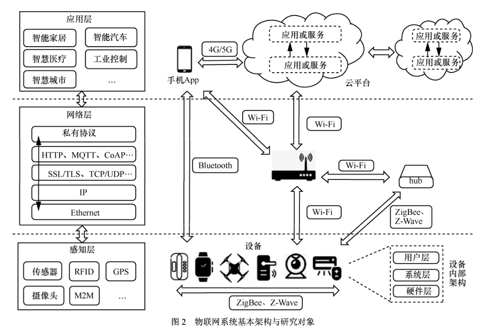
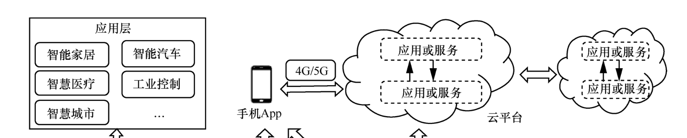
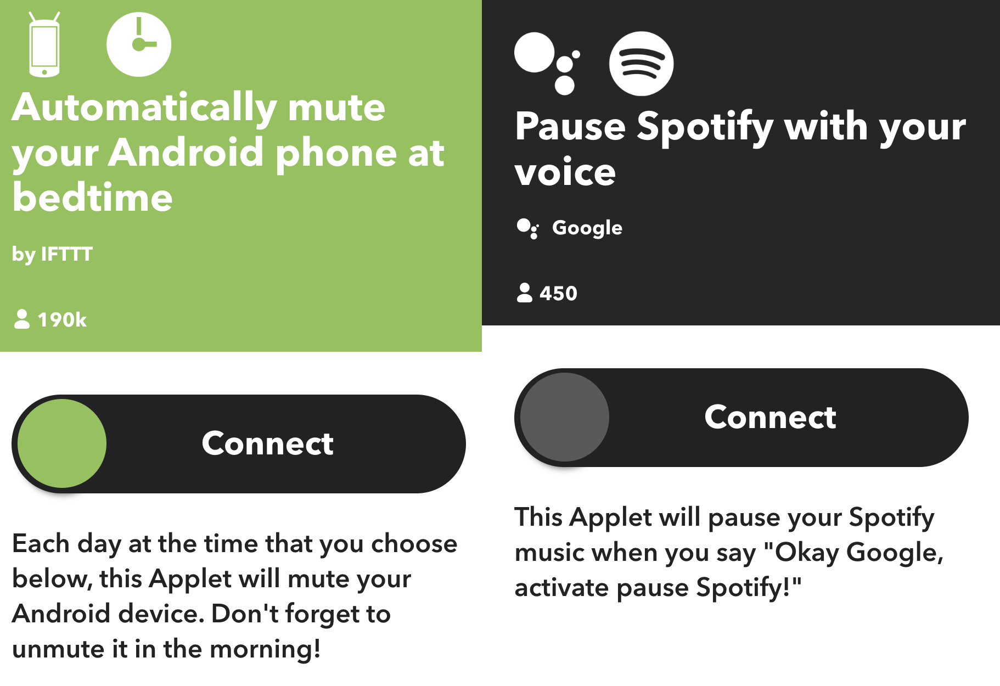
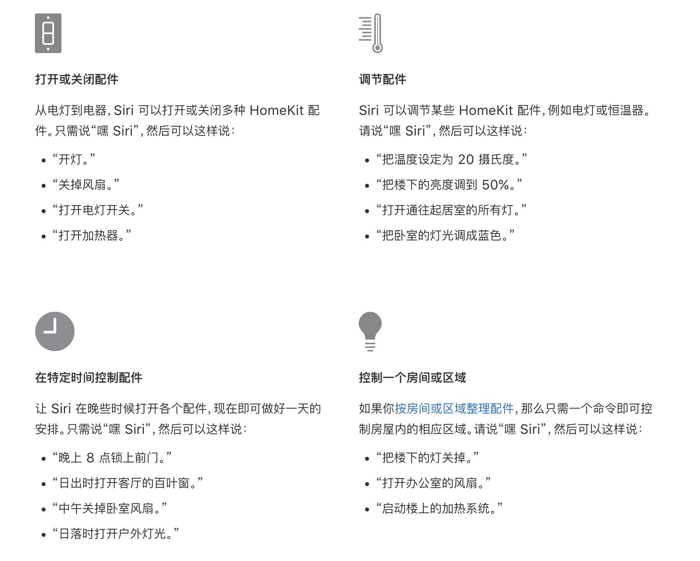
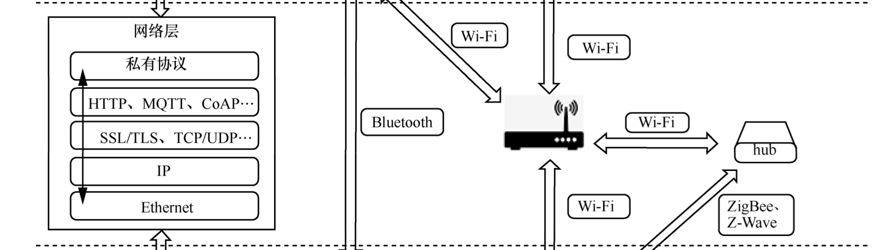
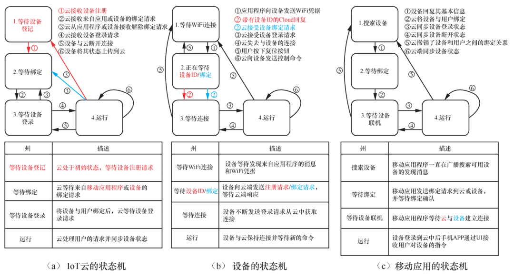
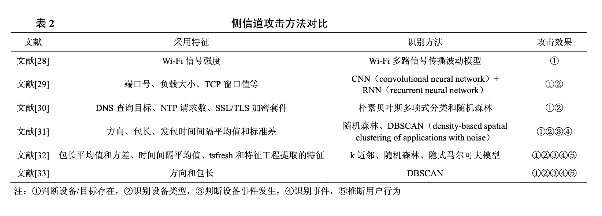
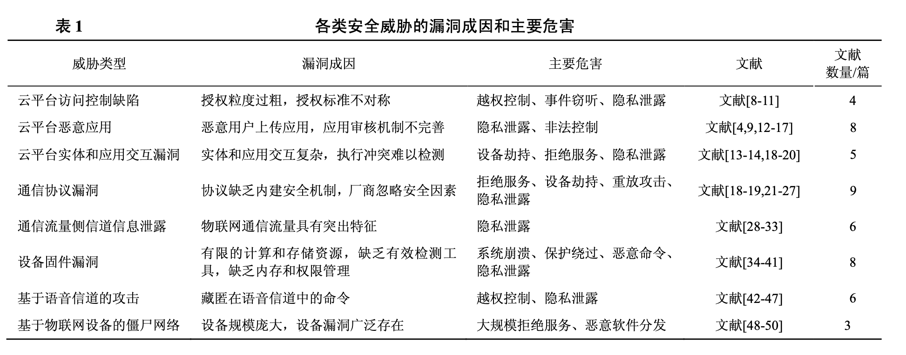
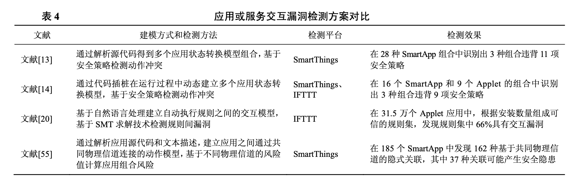
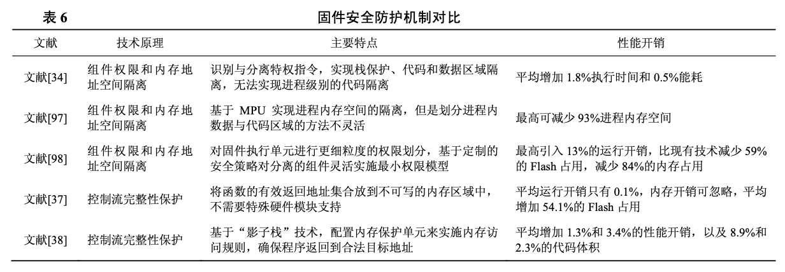

### **物联网安全研究综述:威胁、检测与防御**

2023/9/21

<!-- 老师同学大家好。

充电桩安全是物联网安全的一部分，因此今天为大家介绍的是一篇介绍物联网安全研究的综述。
这篇是基于 2016 年—2020 年网络安全会议 (ACM CCS、USENIX Security、NDSS、IEEE S&P)中发表的物联网安全相关文献，以及其他在物联网安全研究方面的高水平工作进行的调研和总结。

（读下来感觉对于IoT领域的安全相关进行一个总体的认识有一定的帮助）

 -->

---

### 目录

- **物联网基本架构**
- 物联网安全威胁分类
- 物联网安全威胁检测
- 物联网安全威胁防御

---

### 物联网的基本架构

+ 应用层
+ 网络层
+ 感知层

<!-- 先来介绍一下物联网的基本架构 -->

---

### 物联网的基本架构：应用层

云平台、手机 App等

<!-- (用户可以直接看到的) -->

云平台：主要由厂商在云端部署的各类应用服务组成，负责管理设备和用户，对设备收集的数据进行处理， 或向设备发送远程控制命令。

+ 分为设备接入平台、服务联动平台、语音助手平台

---
### 物联网的基本架构：应用层

+ **设备接入平台**、服务联动平台、语音助手平台

+ 设备接入平台：提供了实际的设备接入和管理功能，可以直接控制设备。如 Samsung SmartThings、 Google Home、Philips Hue、小米米家等

<!-- 这个时候我带了一个打印机 -->

---

### 物联网的基本架构：应用层

+ 设备接入平台、**服务联动平台**、语音助手平台

+ 服务联动平台并没有连接真实的设备，而是将其他平台的功能连接起来，提供“条件−动作”自动执行规则服务，如 IFTTT 平台等

<!-- 这个就是把不同应用的一些规则整合起来进行自动化。
例如：每个月提醒自己还花呗
例如：快到了结婚纪念日的时候发个邮件
例如：提醒team member交工作总结
例如：到时间了自动给手机静音
例如：声控播放音乐
就是相当于一个整合的作用
 -->

---

### 物联网的基本架构：应用层

+ 设备接入平台、**服务联动平台**、语音助手平台

+ 服务联动平台并没有连接真实的设备，而是将其他平台的功能连接起来，提供“条件−动作”自动执行规则服务，如 IFTTT 平台等

<!-- 这个就是把不同应用的一些规则整合起来进行自动化。
例如：每个月提醒自己还花呗
例如：快到了结婚纪念日的时候发个邮件
例如：提醒team member交工作总结
例如：到时间了自动给手机静音
例如：声控播放音乐
就是相当于一个整合的作用
 -->

---

### 物联网的基本架构：应用层

+ 设备接入平台、服务联动平台、**语音助手平台**
+ 语音助手平台：通过智能音箱向用户提供语音控制服务，用户发出的语音命令经语音平台处理后可以与其他控制设备的功能或服务连接到一起，如 Amazon Alexa，小度，Siri等。

<!-- 也许可以理解为语音控制+或许有设备接入 -->

---

### 物联网的基本架构：网络层

设备之间，以及设备、云平台、手机App这三类实体之间的通信

设备之间通信：
+ 可以通过 ZigBee、Z-Wave 等轻量级协议形成自组网络
+ 经路由器连接后形成局域网(如智能家居网络)

---

### 物联网的基本架构：网络层

设备之间，以及设备、云平台、手机App这三类实体之间的通信

设备和路由器之间连接:
+ 直接通过 Wi-Fi 连接
+ 或通过 ZigBee、Z-Wave 等协议与网关设备(如 hub)连接后，再经网关通过 Wi-Fi 与路由器通信

---

### 物联网的基本架构：网络层

设备之间，以及设备、云平台、手机App这三类实体之间的通信

实体之间通信:
+ 设备与手机App 通信：通过蓝牙直接连接手机(如可穿戴设备、车载系统网络)；或通过局域网 Wi-Fi 与手机通信(如智能家居网络);
+ 设备与云平台通信：设备依靠路由器转发请求和接收响应，而路由器与云平台的通信主要由传统 TCP/IP 网络架构实现;
+ 手机 App 与云平台通信：手机 App 可以通过 4G/5G 网络或局域网 Wi-Fi 连接云平台。

---

### 物联网的基本架构：感知层

+ 各类物联网设备
+ 设备内部架构：
  + 硬件层（传感器等）
  + 系统层（固件）
  + 用户层（操作接口）

<!-- 设备通过传感器实时收集应用场景信息并发送给应用层，或接收应用层指令并执行相应动作。设备的内部架构可 以分为硬件层、系统层、用户层。

其中，硬件层包 括支持设备功能的各种硬件模组(如网络模组、传感器模组等)、处理器、外围电路等;系统层装载了固件程序，其中包括操作系统和应用程序，负责设备功能的实现;用户层主要向用户提供展示数据和接收输入的操作接口。 -->

---

### 目录

- 物联网基本架构
- **物联网安全威胁分类**
- 物联网安全威胁检测
- 物联网安全威胁防御

<!-- 以上就是物联网的一个整体的架构。可以看出里面的攻击面还是挺多的。下面要介绍的就是物联网的安全威胁，对它可以进行一个分类。 -->

---

### 物联网安全威胁分类

+ 云平台访问控制缺陷
+ 云平台恶意应用
+ 云平台实体和应用交互漏洞
+ 通信协议漏洞
+ 通信流量侧信道信息泄露
+ 设备固件漏洞
+ 基于语音信道的攻击
+ 基于物联网设备的僵尸网络

---

### 物联网安全威胁：1. 云平台访问控制缺陷

现有研究显示，云平台的访问控制问题突出。根据授权类型，可以将权限管理的威胁分为平台内和平台间 2 种。

1. 平台内：部分平台对内部应用或服务的权限管理设计存在漏洞

例如 SmartThings 和 IFTTT 。Fernandes等发现这 2 家平台都对连接设备的应用或服务采取了粗粒度的权限划分方式，应用或服务可以获得其申请范围之外的权限，导致攻击者可以利用这种缺陷对他人的设备轻易发起信息监听或越权控制。

---

### 物联网安全威胁：1. 云平台访问控制缺陷

现有研究显示，云平台的访问控制问题突出。根据授权类型，可以将权限管理的威胁分为平台内和平台间 2 种。

2. 云平台之间：进行相互授权的过程中存在设计漏洞

+ 大部分云平台都允许用户将注册在其他厂商平台下的设备，经过授权后与自家平台联接
+ 目前缺乏统一的平台间授权标准
+ 权限交接时可能会因为平台之间不对称的授权要求而暴露新的漏洞
+ 安全漏洞可能导致攻击者可以通过代理平台绕过设备自身平台的保护机制，对设备发起非法访问

<!-- 当前大部分云平台都允许用户将注册在其他厂商平台下的设备，经过“云云授权”后与自家平台联接(例如，可以将小京鱼平台下的设备 联接到小米米家平台，通过米家App控制小京鱼平台的设备)。然而，在目前缺乏统一的平台间授权 标准的情况下，即使厂商在自身范围内做好了安全 审核，在权限交接时可能会因为平台之间不对称的授权要求而暴露新的漏洞。Yuan 等[11]针对这类安全 问题进行了系统性研究，在多家全球知名的云平台之间的授权过程中都发现了安全漏洞，这些安全漏洞导致攻击者可以通过代理平台绕过设备自身平 台的保护机制，对设备发起非法访问。 -->

---

### 物联网安全威胁：2. 云平台恶意应用

+ 部分平台开放一系列基础设计功能(如 API 或编程框架)给用户，为攻击者提供了实现恶意应用的机会。
+ 对 SmartThings 平台的多项研究都证明该平台的应用开放特性和不完善的审核机制极易引入恶意应用。

<!-- 部分云平台对用户来说是完全封闭的，用户无法获取应用的逻辑或代码，只能安装云平台封装好的应用或自动执行规则。部分平台虽然对用户隐藏底层的运行机制，但会开放一系列基础设计功能(如 API 或编程框架)给用户，用户可以自己编写和发布应用。这类平台包括 SmartThings、IFTTT、Alexa 等，它们虽然提供了更加丰富和灵活的应用生态，但是为攻击者提供了实现恶意应用的机会。 -->

---

### 物联网安全威胁：3. 云平台实体和应用交互漏洞

1. 实体（云平台、手机 App、设备）间交互漏洞

常见物联网云平台交互过程:

+ (1)设备发现：APP一般通过广播的方式和设备进行识别和连接。
+ (2)提供WiFi证书：为了使设备可以通过互联网和云服务进行交互，APP需要向设备提供WiFi证书，其主要方法包括自建热点、WiFi直连和SmartConfig。
+ (3)设备注册：设备通过向云发送其独一无二的物理信息如MAC地址来完成设备注册，并从云端获取设备标识码设备ID。云端也会记录此ID作为此设备的标识用于后续交互。

---

### 物联网安全威胁：3. 云平台实体和应用交互漏洞

+ (4)设备绑定：为了保证只有设备所有者有控制对应设备的权限，用户需要通过APP申请设备绑定。然后云将此用户信息和设备ID进行绑定，后续云平台只允许此用户才可以控制对应ID的设备，拒绝其他用户对此ID设备的控制命令。
+ (5)设备登录：完成设备绑定后，设备申请和云建立并维持一个长连接，同时，如果长时间和云没有交互会自动重新进行连接。
+ (6)设备使用：完成（1）~（5）步骤后，设备处于正常工作状态时可以接受并执行云和用户的远程操作指令。
+ (7)设备注销：当用户不想再使用此设备，如转让给他人，其可以用APP向云发送申请解绑设备的操作。然后云平台解除其与设备的绑定关系，并重置设备使三方实体均回到初始状态。

---
### 物联网安全威胁：3. 云平台实体和应用交互漏洞

---

### 物联网安全威胁：3. 云平台实体和应用交互漏洞

云平台和用户的信息交互模型：

<!-- 在用户访问设备的过程中，设备可能经历注册、绑定、使用、解绑、重置等阶段，在各个阶段中，云平台、手机 App、设备这三类实体需要进行信息交互和状态转换，并且各实体的交互和转换次序必须遵照既定模型进行，如图 3 所示，任一实体 对交互模型的违背都会破坏模型的完整性。 -->

研究者分别对多家全球知名厂商平台的实体交互过程进行检测后发现，厂商对功能的实现并未严格遵守通信模型的规定，例如，用户解除云平台中的设备绑定关系后，设备不会回退到初始状态，而是依然与云平台保持连接，所以攻击者可以在此时对该设备发起绑定请求实现远程劫持。

---

### 物联网安全威胁：3. 云平台实体和应用交互漏洞

2. 应用或服务的交互漏洞

云平台应用或服务的交互情形，可能遇到冲突情况：
+ 多个应用控制相同的设备，此时设备是应用的“交点”
+ 或多个应用的触发条件或执行动作重合，此时条件或动作是应用的“交点”。

当多个应用在同一场景下被使用时，它们在“交点”上可能产生不可预期的执行冲突，而这种冲突会改变应用或服务的执行结果。

---

### 物联网安全威胁：3. 云平台实体和应用交互漏洞

2. 应用或服务的交互漏洞

+ 例如：同时部署的两个服务，“如果检测到烟雾，则打开水阀”和“如果检测到漏水，则关闭水阀”。在实际场景中可能出现：当厨房发生火灾时，烟雾传感器命令水阀打开，同时开启屋顶喷水器。但是漏水传感器检测到水流后命令水阀关闭。

这种威胁不一定来自恶意应用，也可能是由多个良性应用同时执行产生冲突造成的。由于服务规则间交互的复杂性，云平台依靠传统的审核机制难以发现这种问题。

---
### 物联网安全威胁：4. 通信协议漏洞

物联网系统通信融合了传统的 TCP/IP 协议，以及在物联网系统中常见的底层协议和私有协议。

+ 针对传统协议的威胁会被引入物联网
+ 针对物联网特有协议的攻击

---
### 物联网安全威胁：4. 通信协议漏洞

1. 物联网常用协议，如 MQTT(message queuing telemetry transport)、CoAP、ZigBee、低功耗蓝牙等

+ 适配于低功耗设备和低带宽需求，在物联网系统中有较高的使用率
+ 并非为存在对抗性的应用场景所设计，因此缺乏内建的安全机制

<!-- 这类协议虽然不是专门为物联网系统定制设计的，但是由于其适配于低功耗设备和低带宽需求的特性而受到众多物联网系统的青睐，因此在物联网系统中有较高的使用率，但是其本身并非为存在对抗性的应用场景所设计，因此缺乏内建的安全机制，厂商在应用和实现这些协议时容易忽略对安全属性的考虑。 -->

---
### 物联网安全威胁：4. 通信协议漏洞

2. 物联网私有协议。

这类协议是指厂商定制设计的协议类型，通常只适用于其平台下设备的通信，且一般不对外开放实现细节。
但是，攻击者通过逆向工程仍可以获取通信细节，如果厂商对私有协议的设计存在缺陷，也可能被攻击者利用后发起攻击。

---

### 物联网安全威胁：5. 通信流量侧信道信息泄露

物联网的通信流量具有明显的可识别特征。例如：
+ 设备只被分配简单的任务和操作
+ 只能发起有限的服务请求
+ 采用固定的协议和传输模式进行通信等

<!-- 物联网系统中规模庞大和种类丰富的网络流量为侧信道攻击的实施提供了可行性条件，同时物联网系统的通信过程具有区别于其他系统的内在特性，例如，设备只被分配简单的任务和操作，只能发起有限的服务请求，并采用固定的协议和传输模式进行通信，所以物联网的通信流量具有明显的可识别特征。 -->

虽然有各类加密机制应用在流量信息保护中，但是仍然不能防止攻击者通过侧信道特征获得设备和用户相关的敏感信息。

---

### 物联网安全威胁：5. 通信流量侧信道信息泄露

信号强度、方向、包长、时间等特征提取后需要采用特定的统计学习方法进行分析，但是可以获得较多关于的设备和活动信息。

---

### 物联网安全威胁：6. 设备固件漏洞

固件是运行在设备中的二进制程序，负责管理设备中的硬件外设以及实现设备的应用功能。

+ 大部分固件所运行的实时操作系统中缺乏基本的安全保护措施
+ 当前缺乏对固件程序进行调试和检测的有效工具

<!-- 导致大量携带漏洞的固件存在于实际产品中，攻击者利用这些漏洞可以对设备进行拒绝服务、非法操作和劫持等攻击。根据固件漏洞产生的原因可以将其分为内存漏洞和逻辑漏洞 2 类。 -->

+ 固件内存漏洞：一般由编码或设计错误引起，会导致内存非法访问、控制流劫持等攻击，如堆栈缓冲区溢出。物联网设备固件主要由底层语言(如 C 语言)开发，在开发过程中会不可避免地引入编码缺陷。
+ 固件逻辑漏洞：固件在认证、授权、应用功能等方面的设计或实现缺陷。

---

### 物联网安全威胁：7. 基于语音信道的攻击

+ 语音助手平台：通过智能音箱向用户提供语音控制服务，用户发出的语音命令经语音平台处理后可以与其他控制设备的功能或服务连接到一起，如 Amazon Alexa，小度，Siri等。

语音助手设备(如智能音箱)在物联网系统中处于控制中心的地位，用户可以通过语音助手设备来控制其他设备，所以对语音设备的攻击将会威胁受其控制的所有设备。

---

### 物联网安全威胁：7. 基于语音信道的攻击

主要攻击方法：在语音信道中藏匿人类无法察觉但设备可以识别的语音信号

多项研究发现了传播语音命令的载体，例如：
+ 将语音信号调制为人类无法识别的高频超声波信号
+ 将语音命令嵌入音乐中
+ 还将承载语音设备的固体作为媒介，通过固体震动频率来传输语音命令等

以上攻击的共同特点是语音设备可以正常接收和解释这种信号，但是人类难以察觉交互过程。

<!-- 有点像针对机器学习的那种攻击，在图像里面改变几个像素点，就能改变识别结果 -->

<!-- ---

### 物联网安全威胁：7. 基于语音信道的攻击

主要攻击方法：在语音信道中藏匿人类无法察觉但设备可以识别的语音信号

隐藏的语音信号在传输过程中面临传播距离和噪声影响的挑战，但这种困难被证明可以克服

例如，Roy 等[46]通过多个扬声器来分离语音信 号的频带，显著增加了攻击距离。Chen 等[47]通过 提取硬件结构和信道频率造成的信号失真影响因 素，以此作为生成语音信号对抗样本的因子之一， 可以有效克服传播中的噪声影响，提高语音信号被 识别的成功率。 -->

---

### 物联网安全威胁：8. 基于物联网设备的僵尸网络

+ 物联网系统中的设备数量众多且规模庞大，其一旦被病毒、木马等恶意软件攻击，就可以组建威力巨大的僵尸网络。
+ 被病毒劫持的设备除了无法正常使用之外，组成的僵尸网络还可被攻击者当作其他恶意行为的“跳板”，为后续的大规模分布式拒绝服务攻击、恶意邮件分发等攻击做好准备。

+ Mirai 病毒以及由其衍生出的多类变种至今仍然是工控系统设备的主要威胁。
  + 受Mirai感染的装置会持续地在互联网上扫描物联网装置的IP地址
  + 扫描到IP地址之后，Mirai会通过超过60种常用默认用户名和密码辨别出易受攻击的装置，然后登录这些装置以注入Mirai软件
  + 受感染的装置会监视一台下发命令与控制的服务器，该服务器将指示发起攻击的目标

<!-- 例如， MadIoT是一种面向电网系统的新型攻击，利用被控制的高功率家庭物联网设备组建僵尸网络，以此操纵电网中的电力需求，进而向电网系统发起攻击，造成局域或大规模停电事故。 -->

<!-- ---

### 物联网安全威胁：8. 基于物联网设备的僵尸网络

此外，Ronen 等[51] 展示了一种利用 ZigBee 协议漏洞可在物联网设备 中进行大规模传播的蠕虫病毒，该病毒可在邻近的 智能路灯之间进行快速传播并导致设备接受远程 控制，攻击者可接管城市的路灯控制权，从而发起 大规模分布式拒绝服务攻击。 -->

---

### 物联网安全威胁：小结

---

### 物联网安全威胁：小结

1. 云平台威胁影响严重，但是当前研究针对的云平台类型有限。针对开放型云平台的研究较多，针对封闭型云平台的研究较少。

<!-- 从近 5 年的研究来看，当前研究比较依赖于平台的 “开放”特性，大多数研究[9-14]都围绕 SmartThings、 IFTTT 等可获取应用内部逻辑的云平台，而当前更多的云平台并不对外开放内部逻辑。在开放平台中已发现的威胁可能在封闭平台中同样存在，因此对封闭平台的类似威胁研究有待探索。 -->

2. 云平台更注重系统机密性的保护，而轻视了系统的完整性和可用性。

<!-- 当前大多云平台通过加密机制对外隐藏应用和通信协议的实现作为主要的安全机制，而对其他的安全因素疏于维护，如身份和权限检查、交互模型维护等。 -->

<!-- 上述的多项研究[11, 18-19, 26]表明，在物联网系统这种存在对抗性交互的环境中，敌手有能力破解加密保护，因此云平台在授权管理、协议应用、实体交互等过程中如果存在安全漏洞，将会被敌手轻易利用，云平台一旦受到威胁，其连接的各类设备将会被攻击者全部攻破。 -->

3. 物联网中的交互逻辑漏洞需要进一步研究。

4. 设备固件漏洞非常重要。固件内存漏洞是设备面临的主要安全威胁，二逻辑漏洞更难被发现。需要提高固件漏洞检测能力。

<!-- 交互逻辑漏洞是物联网系统中新出现的威胁类型。物联网系统的一个显著特点是其中功能实现过程涉及用户、云平台、设备三类实体的交互，同时云平台面向用户提供日益丰富的自动控制服务，各类服务在同一个应用场景下也会存在交互。这些交互在实现之初难以准确判定其中是否存在设计缺陷，甚至导致安全隐患。随着物联网系统应用功能不断提升，交互类型不断复杂化，交互过程中的逻辑漏洞是值得深入研究的方向。 -->

<!-- 4. 设备固件漏洞仍然是设备遭受威胁的主要因素。由于物联网设备的数量庞大，固件漏洞被利用后可以快速传播，造成更大规模的威胁 。随着设备硬件性能不断提升，固件包含的功能愈加丰富，内存漏洞的影响仍然是设备面临的主要安全威胁 -->

<!-- 但是与内存漏洞相比，逻辑漏洞更难发现，而且攻击者利用逻辑漏洞可以实现更加隐秘却更具危害的威胁[40]，因此如何进一步提升逻辑漏洞检测能力是值得后续研究的方向。 -->

5. 针对语音设备的攻击。基于语音平台的恶意应用、利用语音信号的敏感性实施的隐藏语音信号攻击。

<!-- 基于语音信道的控制方式极大地提升了用户访问设备的效率，然而语音信道也引入了新的攻击，一方面是基于语音平台的恶意应用[16-17]，另一方面是利用语音信号的敏感性实施的隐藏语音信号攻击[42-44]，由于语音助手设备在应用场景中的核心地位，基于语音控制的功能越来越丰富，针对这类威胁的研究仍然是研究人员关注的重点。 -->

---

### 目录

- 物联网基本架构
- 物联网安全威胁分类
- **物联网安全威胁检测**
- 物联网安全威胁防御

<!-- 对物联网安全威胁的分类介绍就到这里，下面介绍的是物联网安全威胁的检测 -->

---

### 物联网安全威胁检测

+ 云平台恶意应用检测
+ 云平台实体和应用交互漏洞检测
+ 基于静态分析的固件漏洞检测
+ 基于动态分析的固件漏洞检测
+ 基于手机App的固件漏洞检测
+ 基于侧信道的设备异常检测

<!-- 物联网的安全威胁检测，主要可以分为以下几种类型 -->

---

### 物联网安全威胁检测：1. 云平台恶意应用检测

+ 设备接入平台、服务联动平台：以 SmartThings 和 IFTTT 平台为例，恶意应用或服务引发的典型后果之一是隐私信息泄露
+ 可以采用基于数据流分析的检测方案：追踪敏感数据在应用中的传递过程来识别应用是否将携带敏感信息的数据在未经用户授权的情况下发送给外部不可信的目标
+ 语音平台：当前研究主要采用黑盒测试方案，即通过构造不同形式的 Skill 语音命令输入，来检查执行结果是否产生偏离正常功能的行为
+ FlowFence：在平台中预先建立沙箱隔离所有敏感操作，平台应用必须通过沙箱定义的接口才能访问敏感数据，以此隔离应用中所有可能产生隐私泄露的行为。该方案与具体平台特性无关
---

### 物联网安全威胁检测：2. 云平台实体应用交互漏洞检测

+ 模型检测方法：先对实体或应用的交互过程建模，然后将正常模型和实际运行状态进行对比，检测其中出现的异常。
+ 实体交互漏洞：有限状态机。逆向分析实体的交互过程得到正常的实体交互模型。对比标准交互模型和实时状态检测异常
+ 对应用或服务交互漏洞的检测

<!-- 当前研究中对交互漏洞的检测大多基于模型检测的方法，主要思想是先对实体或应用的交互过程建模，然后将正常模型和实际运行状态进行对比，检测其中出现的异常。 -->

<!-- 主要通过逆向分析实体的交互过程得到各实体状态的正常转换流程，及其组合而成的三元组状态集合，由此构成了实体的正常交互模型。
由于攻击将导致实体出现异常状态转换，或出现异常的三元组集合，因此可根据标准交互模型与实体的实时状态进行对比来检测是否出现异常的交互。
Zhou 等[18]和 Chen 等[19]采用了上述的思路， 通过对多家全球知名物联网云平台的三方交互过程建立实体交互模型和检测，最终在多家平台中验证了漏洞的存在，该漏洞可影响上亿台设备。 -->

<!-- 其次是对应用或服务交互漏洞的检测，由于云平台应用具有不同的实现方式，所以建立的模型也有不同的特点，表 4 对部分方案的建模方式和检测 效果等进行了对比。 -->

---

### 物联网安全威胁检测：3. 基于动态分析的固件漏洞检测

固件静态分析是指不运行固件程序，通过符号执行、污点分析等技术分析二进制文件的代码结构或逻辑关系，检测其中存在的内存漏洞或逻辑漏洞。

+ 符号执行：核心思想是将程序输入变成符号，程序执行结束后可以得到与每条执行路径对应的符号表达式和约束条件，对约束条件进行求解即可得到满足路径需求的输入值。

+ 污点分析：在程序中建立数据依赖关系图，通过污点传播算法追踪从敏感数据源到数据聚集点的路径，并检测路径中是否存在安全问题。

<!-- 符号执行和污点分析都是进行安全分析的方案，（这学期选的课好像会讲） -->

---

### 物联网安全威胁检测：4. 基于动态分析的固件漏洞检测

固件动态分析：通过获取程序运行的实时状态，可以更加准确地发现漏洞。当前研究大多通过将固件程序加载到 QEMU 等仿真软件中，在脱离硬的情况下模拟固件的功能运行，再结合模糊测试等技术检测漏洞。

+ 对基于 Linux 内核且具有完整操作系统功能的固件类型进行仿真运行的成功率较高
+ 但是对于其他基于实时操作系统的固件，或没有操作系统的“裸机”固件难以应用
  + 没有统一的文件格式导致难以加载，部分固件被加密导致难以提取核心代码

+ 解决方法：固件仿真

<!-- 部分研究实现了固件部分仿真[40,63-64]，主要思想是从固件中分离出与检测目标相关的代码执行路径，只对这部分路径进行仿真执行。例如，FIoT 从容易触发内存越界访问的汇聚点函数出发，采用反向程序切片方法得到 从数据输入源到达汇聚点函数的路径，结合符号 执行和模糊测试检测该路径执行过程中是否存在 内存漏洞。 -->

---

### 物联网安全威胁检测：5. 基于手机App的固件漏洞检测

部分物联网厂商向用户提供了手机 App 作为设备控制终端，App中存储了部分设备通信和功能相关的逻辑数据。

<!-- 因此可以通过手机App来分析固件漏洞 -->

总体思想：将 App 看作设备的输入接口，将发向设备的请求参数看作可变异的种子数据，首先在App中自动定位参数的数据源或处理函数；然后对参数值进行变异，通过 App 的原始业务逻辑将变异数据发向设备；最后动态观察真实设备的崩溃信息，以快速检测固件中的内存漏洞。

---

### 物联网安全威胁检测：6. 基于侧信道的设备异常检测

+ 提取流量特征：设备与网络交互过程中产生的流量可以反映设备内部的行为
+ 设备外在物理特征：如电量、电压、速度、重力、方向等
+ 邻近设备的状态和动作：邻近的设备或传感器对于活动发生时的物理环境感知应具有上下文一致性
<!-- 意思就是临近的几个设备给出的数据应该是差不多的，如果有哪个和其他人差别特别大，可能就是被欺骗了 -->

---

### 物联网安全威胁检测：小结

1. 云平台恶意应用检测存在局限性：大部分针对 SmartThings 和 IFTTT 平台。而通用的解决方案需要高度定制化的系统支持。
2. 交互逻辑漏洞的检测面临挑战：现有的研究是通过逆向分析来获得实体交互逻辑建模的。这个建模过程需要大量人工分析，而且当前云平台对通信过程的保密机制越来越严格，使得建模更加困难
3. 固件分析：如何获取固件和加载固件。目前大多数物联网厂商对固件的保护越来越严格，不提供公开下载链接，或者消除了硬件调试接口，或者对更新的固件进行加密

---

### 物联网安全威胁检测：小结

4. 3 种固件漏洞检测方案(静态、动态、App)在真实设备固件检测中各有局限性
    + 静态分析：符号执行和污点分析技术可能面临路径爆炸和过污染的问题
    + 动态分析：固件仿真效果受限于硬件组件属性，以及如何兼容不同的底层架构
    + 基于App的漏洞检测：要求必须有App控制端，而且只能发现固件是否存在漏洞，无法得知漏洞的具体原因和位置

---

### 物联网安全威胁检测：小结

5. 基于侧信道特征的检测方案效果受限。
    + 流量特征容易受到信号强弱、协议类型和通信模式的影响
    + 物理特征严重受限于物理环境因素
    + 上下文特征的提取要求检测目标周围必须存在其他设备

---

### 目录

- 物联网基本架构
- 物联网安全威胁分类
- 物联网安全威胁检测
- **物联网安全威胁防御**

---

### 物联网安全威胁防御：1. 细粒度的云平台访问控制

访问控制问题产生的原因：云平台实现功能时未能遵循最小权限原则。
对于 SmartThings 平台的研究：从 SmartApp 中提取应用运行过程中实时的上下文，判断当前操作是否符合访问控制策略。

+ ContextIoT：提取 SmartApp 内部的执行路径、数据依赖关系、实时变量值、环境参数等信息来表示应用执行操作时的上下文信息，然后在操作执行前主动征求用户授权许可。
+ SmartAuth：通过自然语言处理技术提取 SmartApp 对功能的文本说明中关于操作的信息，再通过污点分析技术在应用运行时获取真实操作，对比真实操作与文本说明是否一致，若不一致则主动通知用户以征求授权。

此外，还有针对IFTTT平台的研究。

<!-- 为什么不讲这个呢，是因为针对这个平台的研究我看不懂 -->

<!-- ---

### 物联网安全威胁防御：1. 细粒度的云平台访问控制

对于 IFTTT 平台的研究： 基于访问令牌联动的服务规则， Fernandes 等[10]针对令牌管理模式中存在的问题提出了一种权限管理的优化方案，该方案引入应用代 理方，并使用权限粒度更小的“规则令牌”将集中式的权限管理模式分散为以应用代理为单位的分布式管理，可以有效解决集中式管理和粗粒度令牌的问题。 -->

---

### 物联网安全威胁防御：2. 安全的通信协议

协议的制定和改进是多方参与且长期演进的过程，因此更重要的是协议应用方必须在业务逻辑中对通信实体的身份和权限实施严格检查。

+ MQTT协议：基于TCP/IP协议栈构建的异步通信消息协议，是一种轻量级的发布、订阅信息传输协议。
+ ZigBee协议：主要特点是近距离、低功耗的传输，同时还在上层协议基础上可以支持自组网等不同形式的组网功能。

还有部分研究面向设备近距离通信设计了新型的安全配对协议，可以克服传统配对协议存在密钥信息易被窃取、需要人工参与等问题。

<!-- 针对 MQTT 协议 模型中缺失的安全属性，应增加通信会话的管理机制、面向消息的访问控制机制，以及限制通配符的功能范围。 -->

<!-- 针对 ZigBee 协议的内在缺陷，应增强设备在加入网络和正常通信这 2 个阶段的加密级别。此外，也有部分研究基于物联网系统特性设计了安全的通信协议。 -->

---

### 物联网安全威胁防御：3. 流量特征隐藏

为了应对形式多样的通信流量侧信道分析。流量特征推理主要是提取流量中的头部特征和统计特征，所以对应的防御方案是消除这 2 种特征与设备和活动的对应关系。

头部特征隐藏：主要目标是在不影响流量转发和不改变负载数据的基础上进行头部信息的再次封装，令攻击者无法获得有意义的头部信息。

+ 通过 DNS 加密技术阻止对网络请求目标的分析
+ 通过隧道转发技术将设备与云服务之间的通信转换为 VPN 节点之间的通信

---

### 物联网安全威胁防御：3. 流量特征隐藏

统计特征：在不破坏正常功能的前提下，改变流量的整体特征。

+ 在正常通信过程中注入欺骗流量妨碍窃听者对真实设备和活动的识别
+ 采用流量塑形技术，通过增加发送时延
+ 注入无关流量来降低或提高单位时间内的通信速率，改变流量传输曲线的形状

---

### 物联网安全威胁防御：4. 基于可信计算的固件安全防护机制

物联网设备内在的软硬件资源受限是导致固件漏洞的主要原因之一，因此部分研究关注如何基于有限条件构建可信的固件运行环境。

1. 将传统安全机制应用于固件程序，增强固件本身的防护性能

+ 对固件程序组件权限和内存地址空间实行分离机制
+ 对固件程序实施控制流完整性保护，确保函数返回地址完整性，以应对控制流劫持攻击

---

### 物联网安全威胁防御：4. 基于可信计算的固件安全防护机制

---

### 物联网安全威胁防御：4. 基于可信计算的固件安全防护机制

物联网设备内在的软硬件资源受限是导致固件漏洞的主要原因之一，因此部分研究关注如何基于有限条件构建可信的固件运行环境。

2. 远程证明

+ 对远程设备执行状态的可信性进行认证。其主要思想是可信的远程校验方通过获取本地证明方的状态信息，来检查证明方当前是否处于可信状态
+ 在物联网系统中，远程认证的主要目标是设备需要提供高时效且细粒度的可认证信息

<!-- 本地是被证明的一方，远程是可信的，提供校验的一方 -->

---

### 物联网安全威胁防御：5. 语音攻击防御

针对隐藏在语音信道中，且用户无法察觉的恶意语音攻击样本。

|解决方案|存在的问题|
|----|----|
|在语音设备的交互过程中增加基于安全提示和语音确认的交互模式，用户需要对敏感操作进行主动确认来提高安全性|这种方法会带来额外的可用性开销，且确认操作容易被用户忽略|
|通过添加专用硬件模块对具有特殊信号特征的语音信号(如高频超声波)进行过滤|需要特殊硬件支持|
|物理隔断语音设备与桌面等硬件媒介的直接接触|为语音设备的可用性增加了负担|

---

### 物联网安全威胁防御：5. 语音攻击防御

|解决方案|存在的问题|
|----|----|
|增加噪声干扰或降低输入音频的采样频率，影响语音识别系统对恶意命令的识别率|同时影响正常语音的识别率|
|通过机器学习算法实现声纹识别区分人类和器生成的语音|这将使语音识别系统产生额外运行开销|
| 人工生成的语音命令缺少人类在现场说话引起的无线信号干扰 | 依赖 Wi-Fi 信号覆盖度较强的环境，且识别过程对信号波动强度敏感 |

---

### 物联网安全威胁防御：小结

1. 云平台访问权限控制：适用面有限。当前研究提出的新型访问控制方案虽然解决了已知的授权管理问题，但目前只能面向有限云平台。

<!-- 相较于传统的云服务，在物联网云平台中，用户访问设备的过程具有更加复杂的关系，例如，多个用户可以对同一个设备进行共享或交互，因此需要精准且高效的访问控制机制。当前研究提出的新型访问控制方案虽然解决了已知的授权管理问题，但目前只能面向有限云平台。 -->

2. 保障通信协议安全仍面临困难。修改通信协议较为困难，现阶段以增加业务逻辑为主。当前提出的设备安全配对协议均建立在“物理邻近即安全”的假设之上，但在物联网中邻近的设备也可能是伪装的恶意设备。

3. 固件的安全防护机制需要进一步提升。现有的设备固件安全防御方案主要采用硬件方案，但是：这些硬件不一定存在，而且可能引入更高的人工成本和功耗.

4. 向语音攻击的防御措施不够完善。现有方案会带来大量的额外开销。

---

### 总结

|挑战|机遇|
|----|----|
|不完善的隐私保护|隐私保护机制方案|
|云平台繁多的应用|复杂环境下的访问权限控制|
|复杂的实体交互模型|基于人工智能的检测和防御方案|
|适用性受限的设备固件分析|高效的固件漏洞检测方案和可信防御架构|
|不统一的通信标准|安全的通信协议|

---
### 参考文献

[1] 物联网安全研究综述:威胁、检测与防御
[2]《网络安全国际学术研究进展》
[3]《物联网前沿实践》

---

<!-- _class: lead -->

<!-- _paginate: false -->

<!-- _backgroundImage: url('./figures/hero-background.svg') -->

# Thanks!
