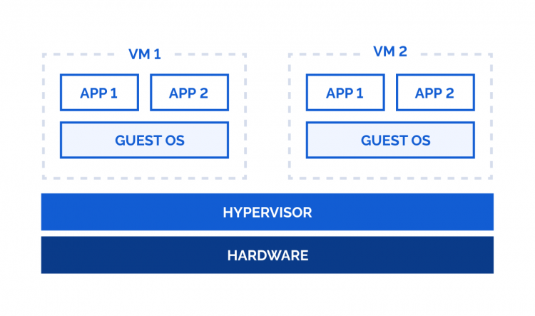
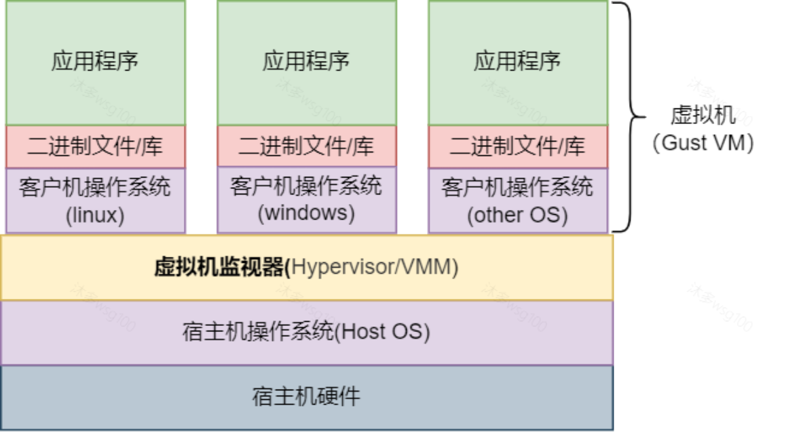
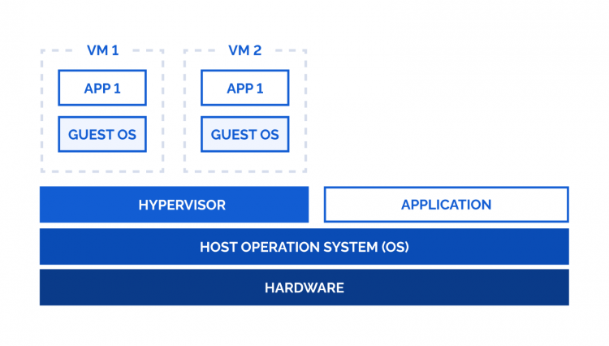

# **Jailhouse调研**

##### 论文：Look Mum, no VM Exits! (Almost)
2023/11/16

---

<style scoped>
section img {
    position: absolute;
    top: 22%;
    left: 57%;
    width: 40%;
}
</style>

## 目录

1. Jailhouse简介
2. 应用场景
3. 实现思路
4. 相关工作
5. 具体实现

---

## Jailhouse简介

1. 许多现代嵌入式系统采用多核CPU作为标准组件，且CPU提供虚拟化扩展，方便同时运行多种服务的时候对其提供隔离。
2. Jailhouse是一种**基于Linux**、**与操作系统无关**的分区管理程序（hypervisor），支持在多核CPU上同时运行多个不同的操作系统，并对其之间提供隔离。

    + **基于Linux**：在启动的时候会借用Linux来启动
    + **与操作系统无关**：含义是Jailhouse的核心代码和它支持的运行在其上面的操作系统并没有什么关系

<!-- 将功能强大的通用系统 Linux 与严格隔离的专用组件结合在一起。
我们的设计目标是简约而不简单，建立一个最小的代码库，并最大限度地减少管理程序的活动。 -->

---

## Jailhouse简介

##### 背景知识：虚拟化技术简介

由软件技术虚拟的计算机称作虚拟机，构成虚拟机的软件框架被称作虚拟化软件（hypervisor）。支持虚拟机运行的计算机可称作宿主机（host）；运行在虚拟机上的操作系统可被称作客户系统（guest）。支撑虚拟化软硬件设施的技术称作虚拟化技术。

虚拟机里面可以运行完整的操作系统，因此云服务商通常会使用虚拟化软件，这样可以承载多个客户系统。一些操作系统也会使用它们，作为沙箱技术的实现之一，来隔离不同的应用程序。

---

## Jailhouse简介

##### 背景知识：虚拟化技术简介

在嵌入式领域，虚拟化技术也是常见的。虚拟化技术可用于隔离不同的应用程序，来提高应用的安全性。虚拟化技术也用于提高兼容性，在新的技术标准下，虚拟化可用于继续运行旧版标准的操作系统。

有名的虚拟化软件包括Xen和KVM等。

---

## 应用场景

+ 一个工业系统是由多种多样不同的组件组合而成的，不同的组件有不同的功能以及安全级别。单一的控制逻辑和专用的物理控制单元紧密关联。一个工业系统可能由关键的逻辑控制任务和非关键的人机界面组成。
    + 这种架构的典型代表就是汽车[3]。
    + 汽车逐渐从组装设备变成了集成系统，不同模块之间可能相互影响
    + 应用软件基于实时操作系统和总线，对实时性和要求较高
+ 将此类系统整合到单一硬件单元成为一种趋势，不仅可以提高软件可维护性，也能降低硬件成本。
+ 不同的组件之间需要互相进行隔离以提升安全性。

<!-- 类比：操作系统上可以同时运行不同的软件，操作系统需要对不同的软件进行隔离。但是这种隔离不同于OS给软件提供的隔离，这是硬件隔离。-->
<!--
---

## Jailhouse使用

就是以用户的角度来看，Jailhouse是什么东西。

后续工作：读文档
现在不想读了。反正读了也没什么用。

-->

<!--
后续工作：在一个机器上跑起来最好，跑不起来就算了。
暂时放弃，显然需要裸机。服务器不行。
-->

---

## Jailhouse实现思路

1. 硬件初始化由 Linux 完成，Jailhouse 可以只专注于管理虚拟化扩展
2. 类似外核的exohypervisor，将物理资源静态分区，分配给多个VM并进行隔离，每个VM自行决定如何使用这些物理资源
3. 假设物理资源无法在VM之间共享。如果需要创建一个新的cell，那么需要释放部分资源，然后分配给新的cell。Linux负责管理CPU资源及其分配，hypervisor负责监控没有非法访问的情况。虚拟化扩展可以保证如果发生了非法访问，会发生trap。
4. Jailhouse希望达到的理想设计是启动和进行分区之后就不管了，只需要在发生违规访问资源的时候介入。但是由于硬件架构的问题，部分无法分区的资源还是需要hypervisor进行虚拟化。

---

## 相关工作

##### 背景知识：type1 hypervisor 和 type-2 hypervisor

+ The type 1 hypervisor sits on top of the bare metal server and has direct access to the hardware resources. Because of this, the type 1 hypervisor is also known as a bare metal hypervisor.
+ In contrast, the type 2 hypervisor is an application installed on the host operating system. It’s also known as a hosted or embedded hypervisor.

---

## 相关工作

##### 背景知识：type1 hypervisor 和 type-2 hypervisor

<style scoped>
section img {
    position: absolute;
    top: 30%;
    left: 20%;
    width: 70%;
}
</style>

type1：



<!-- ---

## 相关工作

##### 背景知识：type1 hypervisor 和 type-2 hypervisor

<style scoped>
section img {
    position: absolute;
    top: 30%;
    left: 20%;
    width: 70%;
}
</style>

type2：
 -->

---

## 相关工作

##### 背景知识：type1 hypervisor 和 type-2 hypervisor

<style scoped>
section img {
    position: absolute;
    top: 30%;
    left: 20%;
    width: 70%;
}
</style>

type2：


---

## 相关工作

##### 背景知识：type1 hypervisor 和 type-2 hypervisor

<style scoped>
section table {
    font-size: 23px;
    width: 100%;
    margin: 0 auto;
    margin-top: 10px
}
</style>

<!-- |      | Type 1 hypervisor  |  Type 2 hypervisor   |
| ---------------- | ---- | ------------ |
|Also known as |Bare metal hypervisor. |Hosted hypervisor. |
|Runs on|Underlying physical host machine hardware.| Underlying operating system (host OS).|
|Best suited for|Large, resource-intensive, or fixed-use workloads.|Desktop and development environments.|
|Can it negotiate dedicated resources?|Yes.|No.|
|Knowledge required|System administrator-level knowledge.|Basic user knowledge.|
|Examples|VMware ESXi, Microsoft Hyper-V, KVM.|Oracle VM VirtualBox, VMware Workstation, Microsoft Virtual PC.| -->

|      | Type 1 hypervisor  |  Type 2 hypervisor   |
| ---------------- | ---- | ------------ |
|Also known as |Bare metal hypervisor. |Hosted hypervisor. |
|Runs on|Underlying physical host machine hardware.| Underlying operating system (host OS).|
|Best suited for|Large, resource-intensive, or fixed-use workloads.|Desktop and development environments.|
|Can it negotiate dedicated resources?|Yes.|No.|
|Knowledge required|System administrator-level knowledge.|Basic user knowledge.|
|Examples|VMware ESXi, Microsoft Hyper-V, KVM.|Oracle VM VirtualBox, VMware Workstation, Microsoft Virtual PC.|


<!-- ---

## 相关工作

KVM： -->

---

## 和相关工作的对比

1. 和type-2 hypervisor相比：Jailhouse最主要的优势就是允许guest OS直接访问硬件资源（至少在设计上是这样）。这在工业场景中会非常重要，因为很多工业场景对**实时性**要求较高，需要保证guestOS独占硬件资源。

2. 与其他type-1 hypervisor相比：只实现“隔离”这一核心功能，有意不实现调度程序以及虚拟CPU等功能，以减少TCB。

3. 出于成本考虑，许多工业应用系统都不能放弃 Linux 的功能和特性。Jailhouse基于Linux开发，可以将最先进的研究或实验系统与基于 Linux 的工业级解决方案整合在一起。

---

## 具体实现（代码）

<!-- 这部分并没有写在论文里，而是通过读代码读出来的。代码已开源。 -->

##### Jailhouse代码结构
+ Driver
    + 源代码路径：driver/
    + 编译生成：jailhouse.ko
    + 简介：C编写的Linux内核模块，创建/dev/jailhouse设备，来为Linux中的用户程序提供操作hypervisor的自定义系统调用接口，例如：启用hypervisor（也就是创建root cell），创建和管理non root cell等。在启用hypervisor时，driver会将hypervisor的binary作为固件加载到内存中，然后跳转到hypervisor的入口点执行。

<!-- 第一部分是driver，是jailhouse的核心模块之一。
它编译生成的是jailhouse.ko，是Linux的一个内核模块，在Linux上安装jailhouse相当于给Linux打了个patch。
其中涉及到很多的细节处理，我就不一一讲了。不过最为核心的是，它是（PPT）
后面的代码内容会具体去讲它如何跳转的。
 -->
---

##### Jailhouse代码结构
+ Hypervisor
    + 源代码路径：hypervisor/
    + 编译生成：jailhouse-${CPU-VERSION}.bin
    + 简介：C编写的firmware，无任何外部依赖（论文里说到的操作系统无关）。向driver提供了两种接口。一是入口函数，供driver调用。另一个是hypercall，被driver包装成ioctl，再进一步被jailhouse命令行工具的方式被root cell的管理员使用。

<!-- 第二部分是hypervisor。hypervisor也是一个核心模块，它编译之后会生成一个二进制文件。它的主要工作方式是向driver提供接口，（PPT）
 -->

---

##### Jailhouse代码结构
+ Configs
    + 源代码路径：configs/
    + 编译生成：*.cell
    + 简介：配置文件，用于描述root cell和non-root cell的硬件配置。
<!-- 第三部分是config，这部分是配置文件。在jailhouse的设计中，root cell和non-root cell其实都可以被当作是一个独立的硬件，这个文件描述的是硬件配置。
 -->

---

##### Jailhouse代码结构
+ Inimates
    + 源代码路径：inimates/
    + 编译生成：*.bin
    + 简介：non-root cell的OS镜像。根据Jailhouse的设计，non-root cell被分配出来后，相当于只有一个机器硬件，还没有软件。需要通过jailhouse cell load加载一个希望运行的二进制文件（例如一个OS）。

<!-- 第四部分是inimates，它（PPT）
 -->
---

##### Jailhouse代码结构
+ Tools
    + 源代码路径：tools/
    + 编译生成：
    + 简介：供Linux host（也就是root cell）管理员使用的工具集，用于操控hypervisor和cell。例如：jailhouse enable/disable，jailhouse cell/consolo子命令等。

<!-- 第五部分是 -->

---

## 具体实现

##### 背景知识：type-1.5 hypervisor

Jailhouse被称为type-1.5 hypervisor。

Jailhouse的hypervisor本身是type-1的，但是在启动过程会借助type-2 hypervisor的帮助。

先作为内核模块被夹在到type-2 hypervisor的hostOS中，然后再将host OS无缝（就是上下文保持一致）将为guest OS，Jailhouse自己变成type-1的hypervisor。


---

## 具体实现

为了更加清楚地了解它怎么做到的，我们不妨阅读一下代码（已开源）

##### Jailhouse的启动流程

1. 从Linux的用户态进入内核态（host模式）执行driver代码（通过ioctl）
2. driver将hypervisor的二进制文件加载到内存中，并对hypervisor进行初始化。
3. 从driver的代码跳转到执行hypervisor的代码
4. hypervisor配置页表、CPU初始状态等，并将CPU mode从host模式切换为guest模式


---

## 具体实现

##### Jailhouse的启动流程

1. 从Linux的用户态进入内核态（host模式）执行driver代码（通过ioctl）

+ 用户开始在Linux（root cell）中的用户态，通过jailhouse命令行工具执行命令，以启动Jailhouse
+ 命令行工具会打开/dev/jailhouse设备，返回一个fd
+ 通过ioctl进内核态，执行driver里的handler，也就是从driver部分的jailhouse_cmd_enable()函数开始执行。

---

## 具体实现

##### Jailhouse的启动流程

1. 从Linux的用户态进入内核态（host模式）执行driver代码（通过ioctl）

+ 用户使用命令行工具，将`/dev/jailhouse`设备作为文件打开，然后获得一个fd。再通过ioctl进入内核。

---

tools/jailhouse.c
```c
static int enable(int argc, char *argv[])
{
	void *config;
	int err, fd;

	if (argc != 3)
		help(argv[0], 1);

	config = read_file(argv[2], NULL);

	fd = open_dev();

	err = ioctl(fd, JAILHOUSE_ENABLE, config);
	if (err)
		perror("JAILHOUSE_ENABLE");

	close(fd);
	free(config);

	return err;
}
```

---

## 具体实现

##### Jailhouse的启动流程

2. driver将hypervisor的二进制文件加载到内存中，并对hypervisor进行初始化

+ driver先将hypervisor加载到内存里一个Linux给driver预留的固定的位置（通过一系列配置实现，细节暂且略过）且这个位置不会与Linux正在使用的内存冲突

driver/main.c
```c
err = request_firmware(&hypervisor, fw_name, jailhouse_dev);
```

---

+ 给hypervisor分配一块物理地址（host Physicall Address），并且在页表（hPT）中建立映射

```c
hypervisor_mem = jailhouse_ioremap(hv_mem->phys_start, remap_addr,
					   hv_mem->size);
```

+ 把hypervisor的二进制文件从前面的内存里的固定位置复制到刚分配的这块内存里，把分配的内存除了二进制文件的部分都初始化为0。

```c
/* Copy hypervisor's binary image at beginning of the memory region
	 * and clear the rest to zero. */
	memcpy(hypervisor_mem, hypervisor->data, hypervisor->size);
	memset(hypervisor_mem + hypervisor->size, 0,
	       hv_mem->size - hypervisor->size);
```

---

+ 对CPU进行初始化配置

```c
/* Copy system configuration to its target address in hypervisor memory
	 * region. */
	config = (struct jailhouse_system *)
		(hypervisor_mem + hv_core_and_percpu_size);
	if (copy_from_user(config, arg, config_size)) {
		err = -EFAULT;
		goto error_unmap;
	}
```

+ 在每个CPU上都执行初始化函数

```c
on_each_cpu(enter_hypervisor, header, 0);
```

---
## 具体实现

##### Jailhouse的启动流程

3. 从driver的代码跳转到执行hypervisor的代码。

+ enter_hypervisor函数

调用地址为`header->entry + (unsigned long) hypervisor_mem`的函数
```c
	entry = header->entry + (unsigned long) hypervisor_mem;

	if (cpu < header->max_cpus)
		/* either returns 0 or the same error code across all CPUs */
		err = entry(cpu);
```

---

这个地址指的是什么函数，是在编译的时候就确定的。实际上调用的是arch_entry函数，因为：

hypervisor/setup.c
```
.entry = arch_entry - JAILHOUSE_BASE,
```

+ arch_entry函数在arm、arm64和x86分别都有对应实现，其的功能就是将上下文保存在Linux内核栈，然后保存rsp后换栈，最后调用entry函数（架构无关）。

---

## 具体实现

##### Jailhouse的启动流程

4. entry函数（这里已经进入hypervisor的二进制文件了）中：hypervisor将页表进行隔离、初始化CPU等，并将CPU mode从host模式切换为guest模式。

在多核场景下，部分初始化工作是每个CPU都要做一次（例如：每个CPU的执行上下文），部分工作是只要有一个CPU做了就可以（例如：地址空间隔离）。

entry会将第一个进入这个函数的CPU选为master，来执行全局初始化的代码。其他CPU只要执行部分代码即可。

---

## 具体实现

##### Jailhouse的启动流程

+ 地址空间隔离（master CPU执行）
+ 初始化CPU状态（每个CPU执行），主要是恢复Linux的执行上下文（对于root cell的Linux来说，它并不能意识到自己的特权级已经被改变了。也就是说从driver跳转到hypervisor的时候保存了Linux的执行上下文，再切回Linux的时候还需要恢复。这样对于Linux来说，就像什么事情都没发生一样）
+ 通过VM LAUNCH跳转到Linux进行执行（每个CPU执行）


<!--
---

+ 地址空间隔离

##### 背景知识：嵌套页表 or 影子页表

仔细讲的话可能太长了，应该就跳过这里了。

两者分别是什么，以及优势和劣势对比 -->

---

+ 地址空间隔离

CPU在host模式下运行，和CPU在guest模式下运行，使用的并不是同一套页表。正常来说，需要确保hypervisor和Linux互相不能访问对方的内存。

在进入entry函数的时候，hypervisor只换了栈，页表基地址还并没有切换。也就是说hypervisor此时可以自由访问Linux的内存。

这一步做的事情就是借用Linux的页表来建立hypervisor的页表，然后对两者的内存进行隔离。

<!--

具体细节就不仔细展开了，
总之进行了一大波内存映射等操作。

 -->

---

## 具体实现

##### Jailhouse的启动流程

+ 初始化CPU状态

具体而言，做了以下两件事：

1. 将刚才在arch_entry函数中保存的寄存器状态复制到hypervisor的per-CPU stack中
2. 切换其他系统寄存器，例如页表基地址、每个CPU的栈顶地址、VM exit handler地址等

---

## 具体实现

##### Jailhouse的启动流程

+ 从host模式切换到guest模式

vcpu_activate_vmm()调用svm_vmentry函数，装作自己是在处理vm exit，然后从per-CPU stack恢复刚刚保存的寄存器，最后通过执行VM launch来进入guest模式，切换CPU特权级，且开始执行guest OS（其实还是那个Linux）的代码。

---

## 具体实现

##### 小结

1. Jailhouse的核心结构是：Linux内核模块，hypervisor的二进制文件，用户态的命令行工具，一些配置文件和image等。
2. Jailhouse的启动流程是从Linux的用户态开始的。用户使用命令行工具通过ioctl进入内核态执行driver部分代码，driver将hypervisor二进制文件加载到内存中并跳转到hypervisor入口函数执行，hypervisor对地址空间、CPU状态进行隔离并最终跳转到guest模式。
---

## 总结和启示

1. 此工作聚焦在系统层面，具有一定的基础地位。
2. 无论什么工业系统，只要涉及到不同组件运行在同一个硬件单元上，就一定需要提供安全隔离。
3. Jailhouse依靠硬件提供的虚拟化扩展，可以实现这样的隔离。相比type2的hypervisor：latency较低。相比同样是type1的hypervisor：TCB小，方便验证。
4. 此工作以直通的方式提供了TCB较小的安全隔离方案，相比其他的工作更加适合应用于工业场景。之后考虑以此工作为基础进行进一步的研究。

<!-- 这为我们的项目提供了一种比较新的思路。虽然项目要做的事情是普遍性的挖掘漏洞的框架，并且希望引入AI。但是实际上现有的漏洞挖掘基本上是针对一个比较具体的场景，然后以手动的方式进行挖掘，直接上来就把目标定成一个通用的框架确实有一定难度。

这个工作第一是偏系统层面，这样通用性较强。第二是我注意到在工业系统中提供隔离是非常重要的。我尝试在不同的工业系统中找到共同点，找到的共同点，无论什么系统，只要是不同组件权限和安全层级不同，他们就需要不同组件之间的隔离。之后考虑以这个工作为基础进行进一步调研。 -->

---


## 参考资料

[1]Look Mum, no VM Exits! (Almost)
[2]Protecting Cloud Virtual Machines from Hypervisor and Host Operating System Exploits
[3]Challenges in Automotive Software Engineering
[4]https://github.com/siemens/jailhouse.git
[5]https://github.com/rcore-os/sysHyper
[6]https://aws.amazon.com/compare/the-difference-between-type-1-and-type-2-hypervisors/
[7]https://zhuanlan.zhihu.com/p/463255350
[8]https://www.cnblogs.com/wsg1100/p/17558529.html


---

<!-- _class: lead -->

<!-- _paginate: false -->

<!-- _backgroundImage: url('./figures/hero-background.svg') -->

# Thanks!
